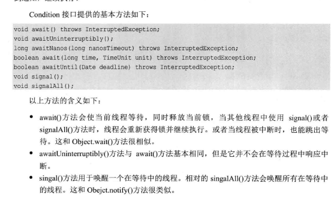

### ReentrantLock与synchronized
```
 * 重入锁ReentrantLock与synchronized相比,
 * 重入锁有着显示的操作过程,我们必须手动指定何时加锁,解锁
 * 因此重入锁对逻辑控制的灵活性要远远好于synchronized
 * 重入锁是可以反复进入的,当然,这里的反复仅仅局限于一个线程
 * 如果一个线程多次获得锁,那么在释放锁的时候,也必须释放相同次数
```
### ReentrantLock几个重要的方法
```
lock():获得锁,如果锁已经被占用,则等待
lockInterruptibly():获得锁但优先响应中断
tryLock():尝试获得锁,但优先响应中断
tryLock(long time,TimeUnit unit):在给定响应内尝试获得锁
unLock():释放锁
```

