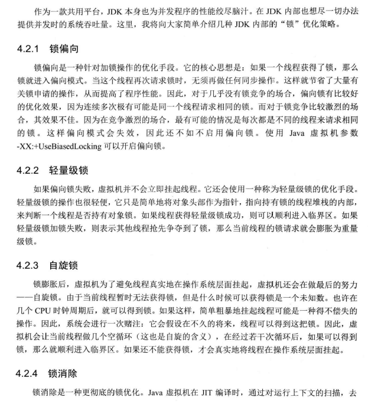

**<h1>[锁优化]("")</h1>**

### 提高**锁**性能的几种方法:

<!-- ---&emsp; -->

1. 减小锁持有时间
```java
public synchronized void syncMethod(){
    other1();//耗时方法1
    sync();
    other2();//耗时方法2
}
//减小锁持有时间优化
public void syncMethod(){
    other1();//耗时方法1
    synchronized(this){
        sync();
    }
    other2();//耗时方法2
}
```
2. 减小锁粒度:
``` 
所谓减少锁粒度,就是缩小锁定对象的范围,从而减少锁冲突的可能,进而提高系统的并发能力
如ConcurrentHashMap它内部细分了若干个HashMap,称之为段(segment)默认被细分为16段
但是,减少锁粒度会引入一个新的问题,即:当系统需要获得全局锁时,其消耗的资源会比较多.比如获取concurrentHashMap的size方法
就会需要同时取得所有段的锁方能顺利实施(事实上size方法会先使用无锁的方法求和,只有失败才会使用这种加锁的方式)
```
3. 读写分离锁来替换独占锁
```
读多写少的情况,使用读写锁可以有效提升系统的并发能力
如:ReadWriteLock
```
4. 锁分离
```
如LinkedBlockingQueue 使用了两把不同的锁分离了take()和put()操作
```
5. 锁粗化
如果对同一个锁不停地请求,同步和释放操作时,其本身也会消耗系统宝贵的资源,反而不利于性能的优化
为此虚拟机在遇到一连串连续的对同一锁不断进行请求和释放的操作时
便会把所有的锁操作整合成对锁的一次请求,从而减少对锁的请求同步次数,这个操作叫做锁的粗化
```java
    public void demoMethod(){
    synchronized(lock){
        //do sth
    }
    //做其他不需要同步的工作,但很快执行完毕
    synchronized(lock){
        //do sth
    }
    }
 //锁粗化为:
    public void demoMethod(){
     synchronized(lock){
         //do sth
         //做其他不需要同步的工作,但很快执行完毕
     }
    }
    for(int i=0;i<num;i++){
     synchronized(lock){
            //do sth
        }
    }
    //锁粗化为:
   synchronized(lock){
    for(int i=0;i<num;i++){
           //do sth
       }
   }
```

6. 使用ThreadLocal

### Java虚拟机对锁优化所做的努力
<table>
    <tr>
      


 </tr>
 </table>


```html
<p>......</p>


<br>


```


<table>
    <tr>
        <td ><center>图1  新垣结衣1 </center></td>
        <td ><center>图2 新垣结衣1</center></td>
    </tr>

    <tr>
        <td><center>图3 新垣结衣2</center></td>
        <td ><center>图4 新垣结衣2</center> </td>
    </tr>

    <tr>
        <td><center> 图5 新垣结衣3</center></td>
        <td><center> 图6 新垣结衣3</center></td>
    </tr>
    
</table>
